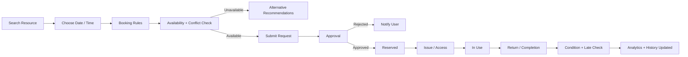
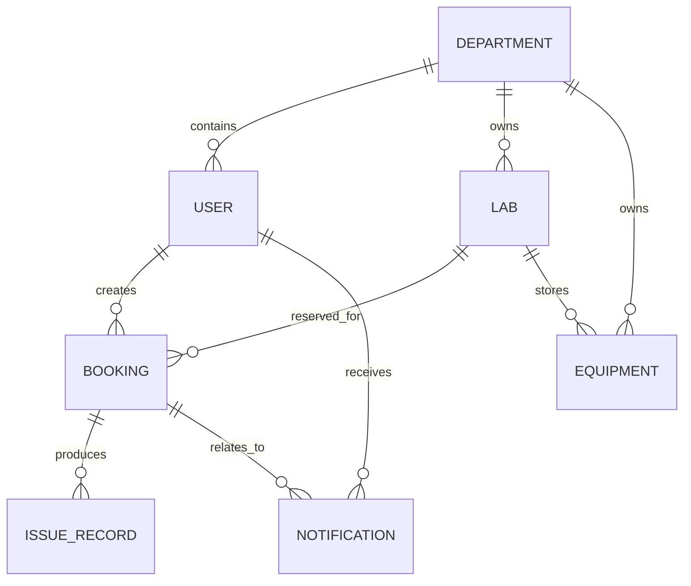

# Project Explanation — University Lab & Equipment Booking System

## 1. Purpose

This project centralizes university laboratory and equipment reservations. It replaces manual paper/WhatsApp-style requests with a controlled workflow that checks availability, prevents resource conflicts, supports staff approval, records equipment issue/return, and exposes usage analytics.

## 2. Main user roles

- **Student / Faculty:** discover resources, create bookings, track status, cancel valid bookings, receive reminders and view history.
- **Lab Staff:** manage lab/equipment state, review booking requests, issue resources, receive returns, record damage/missing items and maintenance state.
- **Department Coordinator:** review department requests, manage department labs, define department rules, set priorities, monitor department usage, and handle conflicts.
- **Administrator:** manage users, departments, labs and equipment categories; view system-wide analytics; assign roles; monitor booking activity. Administrator booking access is read-only.

## 3. Core workflow

## 4. Main folders

### `server/src/models`
Defines SQLite repositories for users, departments, laboratories, equipment, categories, booking rules, bookings, issue/return records, notifications, resource availability watches and audit history.

### `server/src/services`
Contains the business rules. The most important services are:

- `availabilityService.js`: overlap detection and equipment quantity calculations.
- `bookingService.js`: booking creation, approval/rejection and cancellation workflow.
- `recommendationService.js`: smart lab ranking.
- `ruleService.js`: department/default booking-rule enforcement.
- `issueService.js`: issue, return, late-return and damage flow.
- `analyticsService.js`: aggregates booking/resource usage data.

Keeping these rules out of controllers makes the code easier to test and prevents duplicated business logic.

### `server/src/controllers` + `server/src/routes`
Controllers convert HTTP requests into service calls. Routes define endpoints and role permissions.

### `server/src/jobs`
`reminderJob.js` periodically creates booking reminders, return reminders and overdue alerts. It also updates active bookings to overdue when necessary.

### `client/src/pages`
Feature-focused React pages for the public home page, login, dashboard, resources, new booking, booking workflow, issue/return operations, analytics, notifications, user management, resource management, booking rules and activity history.

## 5. Important data relationships

A booking can contain **one optional lab plus multiple equipment line items with quantities**. This supports realistic requests such as “Embedded Systems Lab + 5 Arduino kits” in one transaction.

## 6. Conflict prevention

The backend treats `approved`, `reserved`, `inUse` and `overdue` bookings as resource-consuming states.

For a requested time window:

- Lab conflict exists when another active booking for the same lab overlaps.
- Equipment availability is `total quantity - quantity reserved by overlapping active bookings`.
- A request is rejected when any requested item exceeds remaining quantity.
- A lab with a defined weekly schedule also rejects requests outside that schedule.

Because this logic is on the API, users cannot bypass it by modifying the frontend.

## 7. Smart feature

The required intelligent behavior is implemented as **Smart Resource Recommendation**. The recommendation endpoint scores suitable labs using:

- Current conflict-free availability
- Requested equipment quantity availability
- Capacity suitability
- Department match
- Current resource status

The conflict workflow can also return alternative later time slots.

## 8. Security

- Passwords are hashed with bcrypt.
- JWT protects authenticated API routes.
- Role middleware restricts staff/coordinator/admin operations.
- Zod validates important booking/auth payloads.
- Helmet adds security headers.
- CORS restricts browser origin.
- Rate limiting reduces API abuse.
- Audit records preserve important actions and approval history.

## 9. Notifications

Notifications are persisted in SQLite and displayed in the web app. Events include:

- Booking submitted / approved / rejected / cancelled
- Booking start approaching
- Resource issue and return
- Equipment return approaching
- Equipment overdue
- Watched lab/equipment becomes available again

## 10. Analytics

The analytics service provides:

- Total bookings
- Pending bookings
- Approved/active bookings
- Cancelled bookings
- Currently issued equipment records
- Overdue equipment records
- Damaged returns
- Most-booked labs
- Most-used equipment
- Usage by department
- Monthly booking trend

## 11. Running the project

See `README.md` for environment setup, database startup, dependency installation, seed data, account setup and run commands.

## Verification and design update

The interface uses Manrope headings and DM Sans body text with a plum, warm white, and lime palette. The original logo is reused without editing the image. The public home page introduces the service; authenticated users enter the dashboard.

`server/tests/workflow.cjs` exercises an isolated in-memory SQLite database. It checks department access, lab capacity, duplicate equipment requests, concurrent approvals and automatic reservations, alternative slots, issue/return state, overdue cancellation, damage quarantine, notifications, and analytics. Inventory mutations run serially within a single API process; do not deploy multiple workers without database-level locking. A damaged or missing return conservatively blocks that equipment entry until staff inspect and update it.

The exact role policy is shared in `shared/rolePermissions.json`; administrators do not inherit staff/coordinator operational actions. `server/tests/roleMatrix.cjs` tests positive/negative API access, identity/department boundaries, direct-service enforcement, role assignment, disabled accounts, and JWT role-claim forgery.
